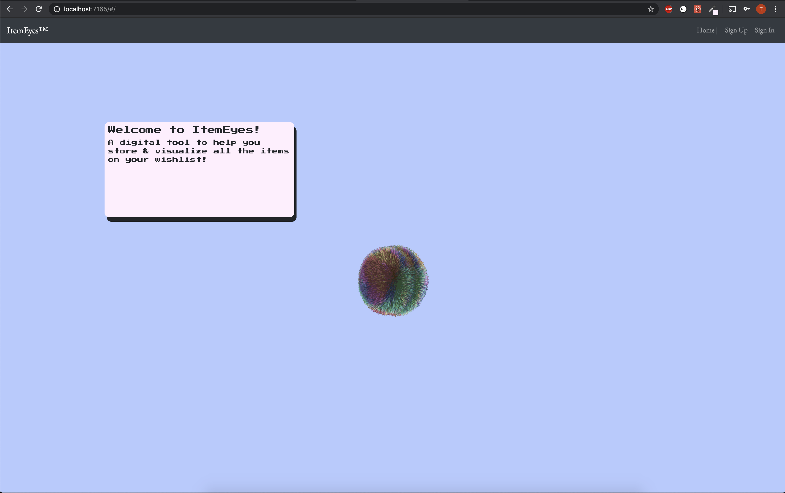
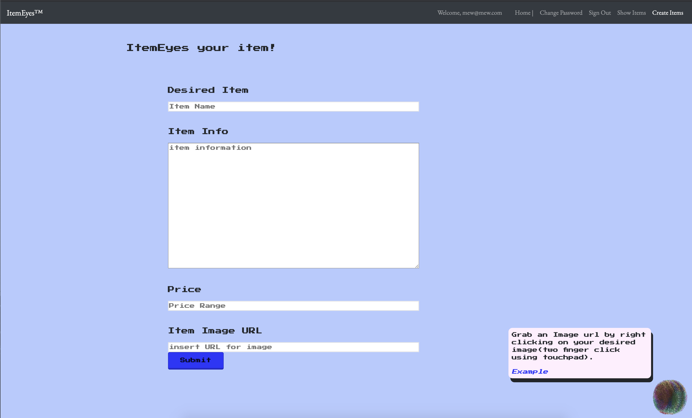
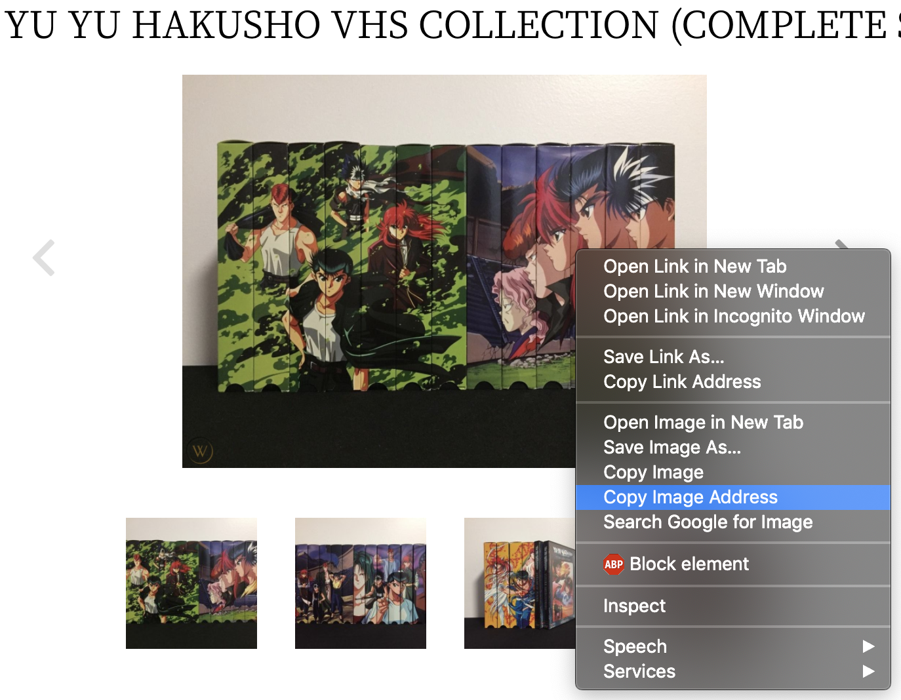
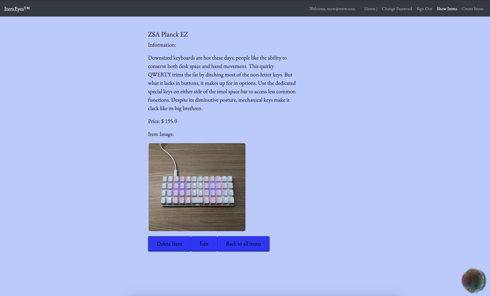

Wireframe - https://imgur.com/8pKGwnl | https://imgur.com/Fet0oOI
ERD - https://imgur.com/0KDQqGl

Concept:

Application where users can add desired items to list to visualize their goals and budget.
This could be fun for niche things or items of rarity that don’t normally come up in the regular listings. App will utilize react.js and ability to insert image url.
User stories -
As an unregistered user, I would like to sign up with email and password.
As an unregistered user, I would like to see items listed
As a registered user, I would like to sign in with email and password.
As a signed in user, I would like to change password.
As a signed in user, I would like to sign out.
As a signed in user, I would like to create an item posting
As a signed in user, I would like to create my own item with image from image url

As a signed in user, I would like to update my own item prospects .
As a signed in user, I would like to delete my own items

 
