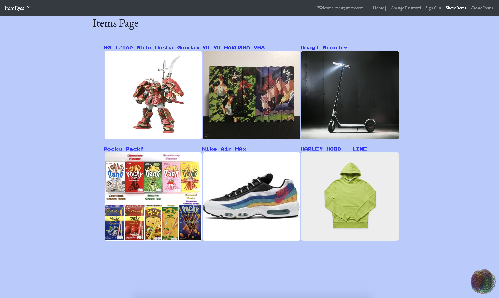

# Important Links
Front End application: https://treyhilson.github.io/itemeyes-client/#/

Front End Repository:https://github.com/TreyHilson/itemeyes-client
Api Repository: https://github.com/TreyHilson/itemeyes-api

Development URL: https://rocky-falls-89890.herokuapp.com/

Version 1.0
Currently application is a tool for user to organize desired items and visualize their list digitally until they have the objects in the material world.
User can create items into database from front end with item name, info, price, and imageurl to embed image onto their list.
Future itirations would allow user to add a method to conctact the user.
This would be if the user is looking to buy or sell items listed.

# Concept:

My goal was a minimum viable product (MVP) that could be built upon for a variation of uses in the future.
Application where users can add desired items to list to visualize their goals and budget.
This could be fun for niche things or items of rarity that don’t normally come up in the regular listings. App will utilize react.js and ability to insert image url.

# User stories -
-As an unregistered user, I would like to sign up with email and password.
-As an unregistered user, I would like to see items listed.
-As a registered user, I would like to sign in with email and password.
-As a signed in user, I would like to change password.
-As a signed in user, I would like to sign out.
-As a signed in user, I would like to create an item posting
-As a signed in user, I would like to create my own item with image from image url.

-As a signed in user, I would like to update my own item prospects.
-As a signed in user, I would like to delete my own items.

# Application Screenshots:

## Setup Steps & Information

You may use the green download button to download .zip package of the entire development bundle.
In the terminal or command prompt run "npm install" to install all dependencies from package.json.
"npm start" from command line/ terminal  to run local host.

Application was built with react framework.
These may be modified from src/components.

npm run nag: runs code quality analysis tools on your code and complains.
npm run make-standard: reformats all your code in the JavaScript Standard Style.
npm run start: generates bundles, watches, and livereloads.
npm run build: place bundled styles and scripts where index.html can find them
npm run deploy: builds and deploys master branch

## Technology Used ##

* React
* JavaScript
* jQuery
* API
* HTML
* SCSS (Sass)
* AJAX
* Bootstrap
* React-router-dom
* Ruby
* Rails

# Wireframe

# ERD

